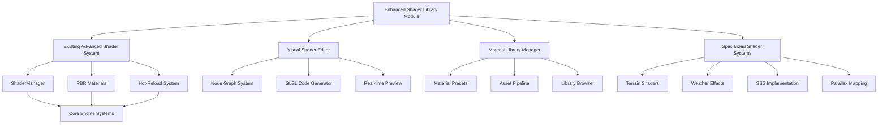

# Design Document - Enhanced Shader Library

## Overview

This design document outlines the implementation of an enhanced shader library system for Game Engine Kiro v1.2. Building upon the existing advanced shader system, this enhancement provides a comprehensive shader library with pre-built materials, visual shader editor, advanced terrain shaders, environmental effects, and specialized rendering techniques. The system is designed as a modular plugin that integrates seamlessly with the existing engine architecture.

## Architecture

### Enhanced Shader Library System Architecture

```
┌─────────────────────────────────────────────────────────────────┐
│                    Enhanced Shader Library Module              │
├─────────────────────────────────────────────────────────────────┤
│  Visual Editor │ Library Manager │ Asset Pipeline │ Dev Tools   │
├─────────────────────────────────────────────────────────────────┤
│                    Specialized Shader Systems                  │
├─────────────────────────────────────────────────────────────────┤
│  Terrain       │ Weather/Env    │ SSS           │ Parallax      │
├─────────────────────────────────────────────────────────────────┤
│                    Material Library System                     │
├─────────────────────────────────────────────────────────────────┤
│  Metal Presets │ Plastic/Glass  │ Organic       │ Custom        │
├─────────────────────────────────────────────────────────────────┤
│                    Existing Advanced Shader System             │
├─────────────────────────────────────────────────────────────────┤
│  ShaderManager │ PBR Materials  │ Hot-Reload    │ Post-Process  │
├─────────────────────────────────────────────────────────────────┤
│                    Core Engine Systems                         │
└─────────────────────────────────────────────────────────────────┘
```

### Module Integration Architecture



## Components and Interfaces

### 1. Enhanced Shader Library Module

```cpp
class EnhancedShaderLibraryModule {
public:
    // Module lifecycle
    bool Initialize();
    void Shutdown();
    void Update(float deltaTime);

    // Module configuration
    void LoadConfiguration(const nlohmann::json& config);
    nlohmann::json SaveConfiguration() const;
    void SetQualityLevel(QualityLevel level);

    // Component access
    MaterialLibraryManager& GetMaterialLibrary() { return *m_materialLibrary; }
    VisualShaderEditor& GetVisualEditor() { return *m_visualEditor; }
    TerrainShaderSystem& GetTerrainSystem() { return *m_terrainSystem; }
    WeatherEffectSystem& GetWeatherSystem() { return *m_weatherSystem; }

    // Integration with existing systems
    void RegisterWithShaderManager(ShaderManager& shaderManager);
    void RegisterWithMaterialSystem(MaterialSystem& materialSystem);

private:
    std::unique_ptr<MaterialLibraryManager> m_materialLibrary;
    std::unique_ptr<VisualShaderEditor> m_visualEditor;
    std::unique_ptr<TerrainShaderSystem> m_terrainSystem;
    std::unique_ptr<WeatherEffectSystem> m_weatherSystem;
    std::unique_ptr<SubsurfaceScatteringSystem> m_sssSystem;
    std::unique_ptr<ParallaxMappingSystem> m_parallaxSystem;

    QualityLevel m_qualityLevel = QualityLevel::High;
    bool m_initialized = false;
};
```

### 2. Material Library Manager

```cpp
class MaterialLibraryManager {
public:
    // Library management
    bool Initialize(const std::string& libraryPath);
    void Shutdown();
    void RefreshLibrary();

    // Material access
    std::shared_ptr<Material> GetMaterial(const std::string& name) const;
    std::vector<std::string> GetMaterialNames() const;
    std::vector<std::string> GetMaterialsByCategory(const std::string& category) const;

    // Material creation and modification
    std::shared_ptr<Material> CreateMaterialFromPreset(const std::string& presetName);
    bool SaveMaterial(const std::string& name, std::shared_ptr<Material> material);
    bool DeleteMaterial(const std::string& name);

    // Library browsing and search
    std::vector<MaterialInfo> SearchMaterials(const MaterialSearchCriteria& criteria) const;
    std::vector<std::string> GetCategories() const;
    std::vector<std::string> GetTags() const;

    // Import/Export
    bool ImportMaterialLibrary(const std::string& path);
    bool ExportMaterialLibrary(const std::string& path, const std::vector<std::string>& materialNames);
    bool ImportFromShaderToy(const std::string& shadertoyId);

    // Preset management
    void LoadPresets();
    std::shared_ptr<MaterialPreset> GetPreset(const std::string& name) const;
    std::vector<std::string> GetPresetNames() const;

private:
    struct MaterialEntry {
        std::string name;
        std::string category;
        std::vector<std::string> tags;
        std::string description;
        std::string thumbnailPath;
        std::shared_ptr<Material> material;
        MaterialMetadata metadata;
    };

    std::unordered_map<std::string, MaterialEntry> m_materials;
    std::unordered_map<std::string, std::shared_ptr<MaterialPreset>> m_presets;
    std::string m_libraryPath;

    void LoadMaterialsFromDirectory(const std::string& directory);
    void GenerateThumbnail(const std::string& materialName);
    MaterialMetadata ExtractMetadata(const nlohmann::json& materialJson) const;
};

struct MaterialSearchCriteria {
    std::string nameFilter;
    std::vector<std::string> categories;
    std::vector<std::string> tags;
    MaterialType type = MaterialType::Any;
    QualityLevel minQuality = QualityLevel::Low;
    QualityLevel maxQuality = QualityLevel::Ultra;
};

struct MaterialInfo {
    std::string name;
    std::string category;
    std::vector<std::string> tags;
    std::string description;
    std::string thumbnailPath;
    MaterialMetadata metadata;
};
```

### 3. Visual Shader Editor System

```cpp
class VisualShaderEditor {
public:
    // Editor lifecycle
    bool Initialize();
    void Shutdown();
    void Update(float deltaTime);

    // Node graph management
    std::shared_ptr<ShaderNodeGraph> CreateNewGraph(const std::string& name);
    bool LoadGraph(const std::string& filepath);
    bool SaveGraph(const std::string& filepath);
    void ClearGraph();

    // Node operations
    std::shared_ptr<ShaderNode> CreateNode(ShaderNodeType type, const Math::Vec2& position);
    bool DeleteNode(uint32_t nodeId);
    bool ConnectNodes(uint32_t outputNodeId, uint32_t outputSlot, uint32_t inputNodeId, uint32_t inputSlot);
    bool DisconnectNodes(uint32_t inputNodeId, uint32_t inputSlot);

    // Code generation
    std::string GenerateVertexShader() const;
    std::string GenerateFragmentShader() const;
    std::string GenerateComputeShader() const;
    bool CompileAndPreview();

    // Preview system
    void SetPreviewMesh(std::shared_ptr<Mesh> mesh);
    void SetPreviewEnvironment(std::shared_ptr<Environment> environment);
    void EnableRealTimePreview(bool enable);

    // Graph validation
    bool ValidateGraph() const;
    std::vector<ValidationError> GetValidationErrors() const;

    // Built-in node library
    std::vector<ShaderNodeType> GetAvailableNodeTypes() const;
    ShaderNodeInfo GetNodeInfo(ShaderNodeType type) const;

private:
    std::shared_ptr<ShaderNodeGraph> m_currentGraph;
    std::unique_ptr<ShaderCodeGenerator> m_codeGenerator;
    std::unique_ptr<ShaderPreviewSystem> m_previewSystem;
    std::unique_ptr<NodeLibrary> m_nodeLibrary;

    bool m_realTimePreview = true;
    uint32_t m_nextNodeId = 1;
};

class ShaderNodeGraph {
public:
    // Node management
    void AddNode(std::shared_ptr<ShaderNode> node);
    void RemoveNode(uint32_t nodeId);
    std::shared_ptr<ShaderNode> GetNode(uint32_t nodeId) const;
    std::vector<std::shared_ptr<ShaderNode>> GetAllNodes() const;

    // Connection management
    bool ConnectNodes(uint32_t outputNodeId, uint32_t outputSlot, uint32_t inputNodeId, uint32_t inputSlot);
    bool DisconnectNodes(uint32_t inputNodeId, uint32_t inputSlot);
    std::vector<NodeConnection> GetConnections() const;

    // Graph analysis
    std::vector<uint32_t> GetTopologicalOrder() const;
    bool HasCycles() const;
    std::shared_ptr<ShaderNode> GetOutputNode() const;

    // Serialization
    nlohmann::json Serialize() const;
    bool Deserialize(const nlohmann::json& json);

private:
    std::unordered_map<uint32_t, std::shared_ptr<ShaderNode>> m_nodes;
    std::vector<NodeConnection> m_connections;
    uint32_t m_outputNodeId = 0;
};

enum class ShaderNodeType {
    // Input nodes
    VertexPosition, VertexNormal, VertexUV, VertexColor,
    Time, CameraPosition, LightDirection,

    // Texture nodes
    TextureSample, TextureSampleLOD, CubemapSample,

    // Math nodes
    Add, Subtract, Multiply, Divide, Power, Sqrt,
    Dot, Cross, Normalize, Length, Distance,
    Sin, Cos, Tan, Abs, Floor, Ceil, Fract,

    // Utility nodes
    Mix, Clamp, Smoothstep, Step, Remap,
    Split, Combine, Swizzle,

    // Lighting nodes
    Lambert, BlinnPhong, PBR, Fresnel,

    // Output nodes
    FragmentOutput, VertexOutput,

    // Advanced nodes
    Noise, Voronoi, Gradient, HSVToRGB, RGBToHSV
};
```

### 4. Terrain Shader System

```cpp
class TerrainShaderSystem {
public:
    // System lifecycle
    bool Initialize();
    void Shutdown();
    void Update(float deltaTime);

    // Terrain material creation
    std::shared_ptr<TerrainMaterial> CreateTerrainMaterial(const std::string& name);
    std::shared_ptr<TerrainMaterial> LoadTerrainMaterial(const std::string& filepath);
    bool SaveTerrainMaterial(const std::string& filepath, std::shared_ptr<TerrainMaterial> material);

    // Layer management
    void AddTextureLayer(std::shared_ptr<TerrainMaterial> material, const TerrainLayer& layer);
    void RemoveTextureLayer(std::shared_ptr<TerrainMaterial> material, uint32_t layerIndex);
    void UpdateTextureLayer(std::shared_ptr<TerrainMaterial> material, uint32_t layerIndex, const TerrainLayer& layer);

    // Blending configuration
    void SetBlendingMode(std::shared_ptr<TerrainMaterial> material, TerrainBlendMode mode);
    void SetBlendingWeights(std::shared_ptr<TerrainMaterial> material, const std::vector<float>& weights);

    // Rendering
    void RenderTerrain(std::shared_ptr<TerrainMaterial> material, const TerrainMesh& mesh, const RenderContext& context);

private:
    std::unique_ptr<TerrainShaderGenerator> m_shaderGenerator;
    std::unordered_map<std::string, std::shared_ptr<Shader>> m_terrainShaders;

    void GenerateTerrainShader(std::shared_ptr<TerrainMaterial> material);
    std::string GenerateBlendingCode(TerrainBlendMode mode, uint32_t layerCount) const;
};

struct TerrainLayer {
    std::shared_ptr<Texture> albedoMap;
    std::shared_ptr<Texture> normalMap;
    std::shared_ptr<Texture> roughnessMap;
    std::shared_ptr<Texture> heightMap;

    Math::Vec2 tiling = Math::Vec2(1.0f);
    float metallic = 0.0f;
    float roughness = 0.5f;
    float normalStrength = 1.0f;
    float heightScale = 0.1f;

    // Blending parameters
    float heightBlendStrength = 1.0f;
    float slopeBlendMin = 0.0f;
    float slopeBlendMax = 1.0f;
    Math::Vec3 blendColor = Math::Vec3(1.0f);
};

enum class TerrainBlendMode {
    HeightBased,
    SlopeBased,
    NoiseBased,
    Triplanar,
    Combined
};

class TerrainMaterial : public Material {
public:
    TerrainMaterial();

    // Layer management
    void AddLayer(const TerrainLayer& layer);
    void RemoveLayer(uint32_t index);
    void UpdateLayer(uint32_t index, const TerrainLayer& layer);
    const std::vector<TerrainLayer>& GetLayers() const { return m_layers; }

    // Blending configuration
    void SetBlendMode(TerrainBlendMode mode) { m_blendMode = mode; }
    TerrainBlendMode GetBlendMode() const { return m_blendMode; }

    // Tessellation settings
    void SetTessellationEnabled(bool enabled) { m_tessellationEnabled = enabled; }
    void SetTessellationLevel(float level) { m_tessellationLevel = level; }

    void ApplyToShader(std::shared_ptr<Shader> shader) const override;

private:
    std::vector<TerrainLayer> m_layers;
    TerrainBlendMode m_blendMode = TerrainBlendMode::HeightBased;
    bool m_tessellationEnabled = false;
    float m_tessellationLevel = 4.0f;
};
```

### 5. Weather and Environmental Effects System

```cpp
class WeatherEffectSystem {
public:
    // System lifecycle
    bool Initialize();
    void Shutdown();
    void Update(float deltaTime);

    // Weather state management
    void SetWeatherState(const WeatherState& state);
    WeatherState GetWeatherState() const { return m_currentState; }
    void TransitionToWeather(const WeatherState& targetState, float transitionTime);

    // Individual effect control
    void SetRainIntensity(float intensity);
    void SetSnowIntensity(float intensity);
    void SetFogDensity(float density);
    void SetWindStrength(float strength);
    void SetWindDirection(const Math::Vec3& direction);

    // Surface effects
    void SetWetnessLevel(float wetness);
    void SetSnowAccumulation(float accumulation);
    void UpdateSurfaceEffects(const std::vector<std::shared_ptr<Material>>& materials);

    // Rendering integration
    void ApplyWeatherEffects(const RenderContext& context);
    void RenderVolumetricFog(const Camera& camera);
    void RenderPrecipitation(const Camera& camera);

private:
    struct WeatherState {
        float rainIntensity = 0.0f;
        float snowIntensity = 0.0f;
        float fogDensity = 0.0f;
        float windStrength = 0.0f;
        Math::Vec3 windDirection = Math::Vec3(1.0f, 0.0f, 0.0f);
        float wetnessLevel = 0.0f;
        float snowAccumulation = 0.0f;
        float temperature = 20.0f; // Celsius
        float humidity = 0.5f;
    };

    WeatherState m_currentState;
    WeatherState m_targetState;
    float m_transitionTime = 0.0f;
    float m_transitionDuration = 0.0f;

    std::unique_ptr<RainEffectRenderer> m_rainRenderer;
    std::unique_ptr<SnowEffectRenderer> m_snowRenderer;
    std::unique_ptr<VolumetricFogRenderer> m_fogRenderer;
    std::unique_ptr<WindEffectSystem> m_windSystem;

    void UpdateWeatherTransition(float deltaTime);
    void ApplyWetnessToMaterial(std::shared_ptr<Material> material, float wetness);
    void ApplySnowToMaterial(std::shared_ptr<Material> material, float accumulation);
};

class VolumetricFogRenderer {
public:
    bool Initialize();
    void Shutdown();
    void Render(const Camera& camera, float density, const Math::Vec3& color);

    // Configuration
    void SetScatteringCoefficient(float coefficient);
    void SetAbsorptionCoefficient(float coefficient);
    void SetPhaseFunction(float g); // Henyey-Greenstein phase function parameter

private:
    std::shared_ptr<Shader> m_volumetricFogShader;
    std::shared_ptr<ComputeShader> m_fogComputeShader;
    uint32_t m_fogVolumeTexture = 0;
    uint32_t m_noiseTexture = 0;

    float m_scatteringCoeff = 0.1f;
    float m_absorptionCoeff = 0.05f;
    float m_phaseG = 0.8f;
};
```

### 6. Subsurface Scattering System

```cpp
class SubsurfaceScatteringSystem {
public:
    // System lifecycle
    bool Initialize();
    void Shutdown();

    // SSS material creation
    std::shared_ptr<SSSMaterial> CreateSSSMaterial(const std::string& name);
    void ApplySSSToMaterial(std::shared_ptr<Material> material, const SSSParameters& params);

    // Rendering techniques
    void RenderWithScreenSpaceSSS(const std::vector<RenderObject>& objects, const RenderContext& context);
    void RenderWithTextureSpaceSSS(const std::vector<RenderObject>& objects, const RenderContext& context);

    // Quality settings
    void SetSSSQuality(SSSQuality quality);
    void SetSampleCount(uint32_t samples);

private:
    enum class SSSQuality { Low, Medium, High, Ultra };

    std::shared_ptr<Shader> m_sssShader;
    std::shared_ptr<Shader> m_screenSpaceSSSShader;
    std::shared_ptr<ComputeShader> m_sssBlurShader;

    SSSQuality m_quality = SSSQuality::High;
    uint32_t m_sampleCount = 16;

    // Screen-space SSS resources
    uint32_t m_sssFramebuffer = 0;
    uint32_t m_sssColorTexture = 0;
    uint32_t m_sssDepthTexture = 0;

    void SetupScreenSpaceSSS();
    void PerformSSSBlur(uint32_t inputTexture, uint32_t outputTexture, const SSSParameters& params);
};

struct SSSParameters {
    Math::Vec3 scatteringColor = Math::Vec3(1.0f, 0.2f, 0.1f);
    float scatteringDistance = 1.0f;
    float scatteringIntensity = 1.0f;
    float translucency = 0.5f;
    float ambient = 0.1f;
    float distortion = 0.2f;
    float power = 2.0f;
    float scale = 1.0f;
};

class SSSMaterial : public PBRMaterial {
public:
    SSSMaterial();

    // SSS-specific properties
    void SetSSSParameters(const SSSParameters& params);
    SSSParameters GetSSSParameters() const { return m_sssParams; }

    // Texture maps
    void SetThicknessMap(std::shared_ptr<Texture> texture);
    void SetSubsurfaceMap(std::shared_ptr<Texture> texture);

    void ApplyToShader(std::shared_ptr<Shader> shader) const override;

private:
    SSSParameters m_sssParams;
    std::shared_ptr<Texture> m_thicknessMap;
    std::shared_ptr<Texture> m_subsurfaceMap;
};
```

### 7. Parallax Occlusion Mapping System

```cpp
class ParallaxMappingSystem {
public:
    // System lifecycle
    bool Initialize();
    void Shutdown();

    // Parallax material creation
    std::shared_ptr<ParallaxMaterial> CreateParallaxMaterial(const std::string& name);
    void ApplyParallaxToMaterial(std::shared_ptr<Material> material, const ParallaxParameters& params);

    // Quality settings
    void SetParallaxQuality(ParallaxQuality quality);
    void SetMaxSamples(uint32_t samples);
    void SetMinSamples(uint32_t samples);

private:
    enum class ParallaxQuality { Low, Medium, High, Ultra };

    std::shared_ptr<Shader> m_parallaxShader;
    std::shared_ptr<Shader> m_pomShader; // Parallax Occlusion Mapping

    ParallaxQuality m_quality = ParallaxQuality::High;
    uint32_t m_maxSamples = 32;
    uint32_t m_minSamples = 8;
};

struct ParallaxParameters {
    float heightScale = 0.1f;
    float minLayers = 8.0f;
    float maxLayers = 32.0f;
    bool enableSelfShadowing = true;
    float shadowStrength = 0.5f;
    bool enableSilhouetteCorrection = true;
};

class ParallaxMaterial : public PBRMaterial {
public:
    ParallaxMaterial();

    // Parallax-specific properties
    void SetParallaxParameters(const ParallaxParameters& params);
    ParallaxParameters GetParallaxParameters() const { return m_parallaxParams; }

    // Height map
    void SetHeightMap(std::shared_ptr<Texture> texture);
    std::shared_ptr<Texture> GetHeightMap() const { return m_heightMap; }

    void ApplyToShader(std::shared_ptr<Shader> shader) const override;

private:
    ParallaxParameters m_parallaxParams;
    std::shared_ptr<Texture> m_heightMap;
};
```

## Data Models

### Material Preset System

```cpp
class MaterialPreset {
public:
    enum class PresetType { Metal, Plastic, Glass, Wood, Fabric, Organic, Custom };

    MaterialPreset(const std::string& name, PresetType type);

    // Preset properties
    const std::string& GetName() const { return m_name; }
    PresetType GetType() const { return m_type; }
    const std::string& GetDescription() const { return m_description; }

    // Material creation
    std::shared_ptr<Material> CreateMaterial() const;
    void ApplyToMaterial(std::shared_ptr<Material> material) const;

    // Serialization
    nlohmann::json Serialize() const;
    bool Deserialize(const nlohmann::json& json);

private:
    std::string m_name;
    PresetType m_type;
    std::string m_description;
    std::unordered_map<std::string, MaterialProperty> m_properties;
    std::unordered_map<std::string, std::string> m_texturePaths;
};

// Specific preset implementations
class MetalPreset : public MaterialPreset {
public:
    enum class MetalType { Steel, Aluminum, Copper, Gold, Silver, Iron, Brass };

    MetalPreset(MetalType metalType);

private:
    void SetupMetalProperties(MetalType type);
};

class PlasticPreset : public MaterialPreset {
public:
    enum class PlasticType { Matte, Glossy, Rough, Smooth, Colored };

    PlasticPreset(PlasticType plasticType);

private:
    void SetupPlasticProperties(PlasticType type);
};
```

### Quality Level System

```cpp
enum class QualityLevel {
    Low,    // Basic features, optimized for low-end hardware
    Medium, // Standard features, balanced performance
    High,   // Advanced features, good hardware required
    Ultra   // All features enabled, high-end hardware
};

struct QualitySettings {
    // Shader complexity
    uint32_t maxShaderInstructions = 1024;
    uint32_t maxTextureUnits = 16;
    bool enableComputeShaders = true;

    // Terrain settings
    uint32_t maxTerrainLayers = 8;
    bool enableTessellation = true;
    bool enableTriplanarMapping = true;

    // Weather effects
    bool enableVolumetricFog = true;
    bool enableAdvancedPrecipitation = true;
    uint32_t weatherParticleCount = 10000;

    // SSS settings
    uint32_t sssSampleCount = 16;
    bool enableScreenSpaceSSS = true;

    // Parallax settings
    uint32_t parallaxMaxSamples = 32;
    uint32_t parallaxMinSamples = 8;
    bool enableParallaxSelfShadowing = true;

    static QualitySettings GetPreset(QualityLevel level);
};
```

## Error Handling

### Enhanced Error Handling System

```cpp
class ShaderLibraryException : public std::runtime_error {
public:
    enum class ErrorType {
        LibraryNotFound,
        MaterialNotFound,
        InvalidPreset,
        CompilationFailed,
        UnsupportedFeature,
        ResourceLoadFailed
    };

    ShaderLibraryException(ErrorType type, const std::string& message);

    ErrorType GetErrorType() const { return m_errorType; }

private:
    ErrorType m_errorType;
};

class ErrorRecoverySystem {
public:
    // Fallback material creation
    static std::shared_ptr<Material> CreateFallbackMaterial(const std::string& originalName);

    // Feature detection and fallbacks
    static bool IsFeatureSupported(const std::string& featureName);
    static void RegisterFallback(const std::string& feature, std::function<void()> fallbackFunc);

    // Error reporting
    static void ReportError(const ShaderLibraryException& error);
    static void SetErrorCallback(std::function<void(const ShaderLibraryException&)> callback);

private:
    static std::unordered_map<std::string, std::function<void()>> s_fallbacks;
    static std::function<void(const ShaderLibraryException&)> s_errorCallback;
};
```

## Testing Strategy

### Unit Testing Approach

The testing strategy follows the existing testing standards while focusing on the new enhanced shader library features:

```cpp
// Test material library management
bool TestMaterialLibraryManager() {
    TestOutput::PrintTestStart("material library manager");

    MaterialLibraryManager library;
    EXPECT_TRUE(library.Initialize("assets/materials"));

    // Test material loading
    auto material = library.GetMaterial("metal_steel");
    EXPECT_NOT_NULL(material);

    // Test material search
    MaterialSearchCriteria criteria;
    criteria.categories = {"metal"};
    auto results = library.SearchMaterials(criteria);
    EXPECT_TRUE(results.size() > 0);

    TestOutput::PrintTestPass("material library manager");
    return true;
}

// Test visual shader editor node graph
bool TestShaderNodeGraph() {
    TestOutput::PrintTestStart("shader node graph");

    ShaderNodeGraph graph;

    // Create nodes
    auto inputNode = std::make_shared<ShaderNode>(ShaderNodeType::VertexPosition);
    auto outputNode = std::make_shared<ShaderNode>(ShaderNodeType::FragmentOutput);

    graph.AddNode(inputNode);
    graph.AddNode(outputNode);

    // Test connection
    EXPECT_TRUE(graph.ConnectNodes(inputNode->GetId(), 0, outputNode->GetId(), 0));
    EXPECT_FALSE(graph.HasCycles());

    TestOutput::PrintTestPass("shader node graph");
    return true;
}

// Test terrain material system
bool TestTerrainMaterial() {
    TestOutput::PrintTestStart("terrain material");

    TerrainMaterial material;

    // Add layers
    TerrainLayer grassLayer;
    grassLayer.tiling = Math::Vec2(4.0f, 4.0f);
    grassLayer.metallic = 0.0f;
    grassLayer.roughness = 0.8f;

    material.AddLayer(grassLayer);
    EXPECT_EQUAL(material.GetLayers().size(), 1);

    // Test blending mode
    material.SetBlendMode(TerrainBlendMode::HeightBased);
    EXPECT_EQUAL(material.GetBlendMode(), TerrainBlendMode::HeightBased);

    TestOutput::PrintTestPass("terrain material");
    return true;
}
```

### Integration Testing Approach

```cpp
// Test complete material library workflow
bool TestMaterialLibraryWorkflow() {
    TestOutput::PrintTestStart("material library workflow");

    EnhancedShaderLibraryModule module;
    EXPECT_TRUE(module.Initialize());

    auto& library = module.GetMaterialLibrary();

    // Create material from preset
    auto material = library.CreateMaterialFromPreset("metal_steel");
    EXPECT_NOT_NULL(material);

    // Modify and save
    material->SetProperty("roughness", MaterialProperty(0.3f));
    EXPECT_TRUE(library.SaveMaterial("custom_steel", material));

    // Verify saved material
    auto loadedMaterial = library.GetMaterial("custom_steel");
    EXPECT_NOT_NULL(loadedMaterial);
    EXPECT_NEARLY_EQUAL(loadedMaterial->GetProperty("roughness").AsFloat(), 0.3f);

    TestOutput::PrintTestPass("material library workflow");
    return true;
}

// Test weather effects integration
bool TestWeatherEffectsIntegration() {
    TestOutput::PrintTestStart("weather effects integration");

    if (!OpenGLContext::HasActiveContext()) {
        TestOutput::PrintInfo("Skipping OpenGL-dependent test (no context)");
        TestOutput::PrintTestPass("weather effects integration");
        return true;
    }

    WeatherEffectSystem weatherSystem;
    EXPECT_TRUE(weatherSystem.Initialize());

    // Test weather state changes
    WeatherEffectSystem::WeatherState rainState;
    rainState.rainIntensity = 0.8f;
    rainState.wetnessLevel = 0.6f;

    weatherSystem.SetWeatherState(rainState);
    auto currentState = weatherSystem.GetWeatherState();
    EXPECT_NEARLY_EQUAL(currentState.rainIntensity, 0.8f);

    TestOutput::PrintTestPass("weather effects integration");
    return true;
}
```

## Implementation Phases

### Phase 1: Core Library Infrastructure

- Enhanced Shader Library Module setup
- Material Library Manager implementation
- Basic material preset system
- Integration with existing shader system

### Phase 2: Visual Shader Editor Foundation

- Node graph system implementation
- Basic node types and connections
- GLSL code generation framework
- Simple preview system

### Phase 3: Specialized Shader Systems

- Terrain shader system implementation
- Basic weather effects (rain, fog)
- Subsurface scattering foundation
- Parallax mapping implementation

### Phase 4: Advanced Features and Polish

- Complete visual shader editor
- Advanced weather effects (snow, wind)
- Performance optimization system
- Quality level scaling

### Phase 5: Content Creation and Tools

- Material preset library expansion
- Asset pipeline integration
- Development tools and debugging
- Documentation and examples

### Phase 6: Testing and Validation

- Comprehensive unit testing
- Integration testing with existing systems
- Performance benchmarking
- Hardware compatibility validation

This design provides a comprehensive foundation for the enhanced shader library system, building upon the existing advanced shader system while adding powerful new capabilities for material creation, visual shader editing, and specialized rendering techniques.
