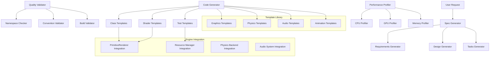

# Design Document: Game Engine Development Power

## Overview

The Game Engine Development Power addresses the critical need for standardized, automated tooling in game engine development. Currently, developers must manually create specifications, design documents, and implementation tasks, leading to inconsistent patterns and potential quality issues. This power leverages the successful patterns demonstrated in Game Engine Kiro's skeletal rendering system to provide comprehensive development automation.

The power integrates deeply with Game Engine Kiro's architecture, understanding its Windows-focused C++20 development environment, OpenGL 4.6+ rendering pipeline, dual physics backend strategy (Bullet Physics and PhysX), and comprehensive testing framework. It provides intelligent code generation, automated spec creation, and quality assurance tools specifically tailored for game engine development.

This design implements a modular power system that can generate complete feature specifications, create properly structured C++ classes following engine conventions, generate comprehensive test suites, and provide performance optimization guidance—all while maintaining strict adherence to the engine's professional standards.

## Architecture

### Power System Components



### Integration Architecture

The power integrates with existing Game Engine Kiro systems through well-defined interfaces:

- **Build System Integration**: Seamless CMake integration with automatic target discovery
- **Testing Framework Integration**: Direct integration with TestUtils.h and existing test patterns
- **Engine Module Integration**: Automatic integration with Graphics, Physics, Audio, and Resource systems
- **Asset Pipeline Integration**: Follows established asset organization patterns from asset-conventions.md
- **Development Workflow Integration**: Integrates with build_unified.bat and individual test compilation workflows

## Components and Interfaces

### SpecGenerator

Primary component responsible for creating comprehensive feature specifications.

```cpp
namespace GameEnginePower::SpecGeneration {

class SpecGenerator {
public:
    struct FeatureRequest {
        std::string featureName;
        std::string description;
        std::vector<std::string> targetSystems; // Graphics, Physics, Audio, etc.
        std::string complexity; // Simple, Moderate, Complex
        bool includePropertyTests;
        bool includePerformanceProfiling;
    };

    struct GeneratedSpec {
        std::string requirementsDocument;
        std::string designDocument;
        std::string tasksDocument;
        std::vector<std::string> generatedFiles;
        std::vector<std::string> warnings;
    };

    // Core spec generation
    GeneratedSpec GenerateFeatureSpec(const FeatureRequest& request);
    bool ValidateSpecCompliance(const GeneratedSpec& spec);

    // Template management
    void LoadEngineTemplates();
    void RegisterCustomTemplate(const std::string& name, const std::string& content);

    // Quality assurance
    std::vector<std::string> ValidateEARSCompliance(const std::string& requirements);
    std::vector<std::string> ValidateINCOSECompliance(const std::string& requirements);

private:
    std::map<std::string, std::string> m_requirementsTemplates;
    std::map<std::string, std::string> m_designTemplates;
    std::map<std::string, std::string> m_tasksTemplates;

    std::string GenerateRequirementsDocument(const FeatureRequest& request);
    std::string GenerateDesignDocument(const FeatureRequest& request);
    std::string GenerateTasksDocument(const FeatureRequest& request);
};

}
```

### CodeGenerator

Generates properly structured C++ code following Game Engine Kiro conventions.

```cpp
namespace GameEnginePower::CodeGeneration {

class CodeGenerator {
public:
    struct ComponentRequest {
        std::string componentName;
        std::string targetModule; // Graphics, Physics, Audio, etc.
        std::string componentType; // Renderer, Manager, System, etc.
        std::vector<std::string> dependencies;
        bool includeOpenGLSupport;
        bool includeBulletPhysicsSupport;
        bool includePhysXSupport;
        bool includeOpenALSupport;
    };

    struct GeneratedComponent {
        std::string headerFile;
        std::string sourceFile;
        std::string testFile;
        std::string cmakeIntegration;
        std::vector<std::string> dependencies;
    };

    // Core code generation
    GeneratedComponent GenerateEngineComponent(const ComponentRequest& request);
    std::string GenerateShaderPair(const std::string& shaderName, const std::string& shaderType);
    std::string GenerateTestSuite(const std::string& componentName, const std::vector<std::string>& properties);

    // Template management
    void LoadEngineCodeTemplates();
    std::string GetGraphicsTemplate(const std::string& componentType);
    std::string GetPhysicsTemplate(const std::string& backendType);
    std::string GetAudioTemplate(const std::string& componentType);

    // Validation and quality assurance
    bool ValidateNamespaceUniqueness(const std::string& className);
    bool ValidateNamingConventions(const GeneratedComponent& component);
    std::vector<std::string> CheckSymbolConflicts(const GeneratedComponent& component);

private:
    std::map<std::string, std::string> m_classTemplates;
    std::map<std::string, std::string> m_shaderTemplates;
    std::map<std::string, std::string> m_testTemplates;

    std::string ApplyNamingConventions(const std::string& name, const std::string& type);
    std::string GenerateNamespace(const std::string& module, const std::string& component);
    std::string GenerateIncludes(const std::vector<std::string>& dependencies);
};

}
```

### QualityValidator

Ensures all generated code meets Game Engine Kiro's professional standards.

```cpp
namespace GameEnginePower::QualityAssurance {

class QualityValidator {
public:
    struct ValidationResult {
        bool passed;
        std::vector<std::string> errors;
        std::vector<std::string> warnings;
        std::vector<std::string> suggestions;
    };

    // Core validation
    ValidationResult ValidateGeneratedCode(const std::string& headerFile, const std::string& sourceFile);
    ValidationResult ValidateTestCode(const std::string& testFile);
    ValidationResult ValidateShaderCode(const std::string& vertexShader, const std::string& fragmentShader);

    // Specific validation checks
    bool ValidateEnglishOnlyContent(const std::string& content);
    bool ValidateNamespaceUniqueness(const std::string& namespaceName);
    bool ValidateClassNameUniqueness(const std::string& className);
    bool ValidateMacroNaming(const std::string& macroName);

    // Build system validation
    bool ValidateCMakeIntegration(const std::string& cmakeCode);
    bool ValidateBuildCompatibility(const std::vector<std::string>& generatedFiles);

    // Performance validation
    ValidationResult ValidatePerformancePatterns(const std::string& sourceCode);
    ValidationResult ValidateMemoryManagement(const std::string& sourceCode);

private:
    std::set<std::string> m_existingNamespaces;
    std::set<std::string> m_existingClasses;
    std::set<std::string> m_existingMacros;

    void LoadExistingSymbols();
    bool CheckForConflicts(const std::string& symbolName, const std::string& symbolType);
    std::vector<std::string> AnalyzeCodePatterns(const std::string& code);
};

}
```

### PerformanceProfiler

Provides performance monitoring and optimization guidance for generated components.

```cpp
namespace GameEnginePower::Performance {

class PerformanceProfiler {
public:
    struct ProfileConfiguration {
        bool enableCPUProfiling;
        bool enableGPUProfiling;
        bool enableMemoryProfiling;
        uint32_t profilingSamples;
        float performanceThresholdMs;
    };

    struct ProfileResult {
        double averageExecutionTimeMs;
        double peakExecutionTimeMs;
        uint64_t memoryUsageBytes;
        uint64_t peakMemoryUsageBytes;
        std::vector<std::string> bottlenecks;
        std::vector<std::string> optimizationSuggestions;
    };

    // Core profiling
    ProfileResult ProfileComponent(const std::string& componentName, const ProfileConfiguration& config);
    std::string GeneratePerformanceTest(const std::string& componentName, const ProfileConfiguration& config);

    // GPU-specific profiling
    ProfileResult ProfileRenderingComponent(const std::string& componentName);
    ProfileResult ProfileShaderPerformance(const std::string& vertexShader, const std::string& fragmentShader);

    // Memory profiling
    ProfileResult ProfileMemoryUsage(const std::string& componentName);
    std::vector<std::string> DetectMemoryLeaks(const std::string& componentName);

    // Optimization suggestions
    std::vector<std::string> GenerateOptimizationSuggestions(const ProfileResult& result);
    std::string GenerateOptimizedCode(const std::string& originalCode, const std::vector<std::string>& suggestions);

private:
    std::map<std::string, ProfileResult> m_cachedResults;

    void InitializeProfilingTools();
    ProfileResult RunCPUProfiling(const std::string& componentName);
    ProfileResult RunGPUProfiling(const std::string& componentName);
    ProfileResult RunMemoryProfiling(const std::string& componentName);
};

}
```

## Data Models

### Template Data Structures

Comprehensive template system for different engine components:

```cpp
namespace GameEnginePower::Templates {

struct GraphicsComponentTemplate {
    std::string className;
    std::string baseClass;
    std::vector<std::string> requiredIncludes;
    std::vector<std::string> openGLFunctions;
    std::vector<std::string> shaderUniforms;
    std::string renderingPipeline; // Forward, Deferred, etc.
    bool requiresVAO;
    bool requiresUBO;
    bool requiresFBO;
};

struct PhysicsComponentTemplate {
    std::string className;
    std::string physicsBackend; // Bullet, PhysX
    std::vector<std::string> requiredIncludes;
    std::vector<std::string> physicsObjects;
    std::vector<std::string> collisionShapes;
    bool requiresRigidBody;
    bool requiresConstraints;
    bool requiresCollisionDetection;
};

struct AudioComponentTemplate {
    std::string className;
    std::string audioBackend; // OpenAL
    std::vector<std::string> requiredIncludes;
    std::vector<std::string> audioSources;
    std::vector<std::string> audioBuffers;
    bool requires3DPositioning;
    bool requiresEffects;
    bool requiresStreaming;
};

struct AnimationComponentTemplate {
    std::string className;
    std::string animationType; // Skeletal, Morph, Transform
    std::vector<std::string> requiredIncludes;
    std::vector<std::string> animationData;
    std::vector<std::string> blendModes;
    bool requiresBoneMatrices;
    bool requiresBlendTrees;
    bool requiresStateMachine;
};

}
```

### Quality Assurance Data Models

Structures for tracking and enforcing quality standards:

```cpp
namespace GameEnginePower::QualityAssurance {

struct NamingConventionRules {
    std::string classNamingPattern; // PascalCase
    std::string methodNamingPattern; // PascalCase
    std::string variableNamingPattern; // camelCase with m_ prefix
    std::string constantNamingPattern; // UPPER_SNAKE_CASE
    std::string namespaceNamingPattern; // PascalCase
    std::string macroPrefix; // GAMEENGINE_ or GE_
    std::vector<std::string> forbiddenNames;
};

struct CodeQualityMetrics {
    uint32_t linesOfCode;
    uint32_t cyclomaticComplexity;
    uint32_t numberOfClasses;
    uint32_t numberOfMethods;
    uint32_t numberOfTests;
    float testCoverage;
    uint32_t codeSmells;
    uint32_t securityIssues;
};

struct BuildValidationResult {
    bool compilationSuccessful;
    bool linkingSuccessful;
    bool testsPass;
    std::vector<std::string> compilationErrors;
    std::vector<std::string> linkingErrors;
    std::vector<std::string> testFailures;
    double buildTimeSeconds;
};

}
```

### Performance Monitoring Data Models

Structures for performance tracking and optimization:

```cpp
namespace GameEnginePower::Performance {

struct CPUPerformanceMetrics {
    double executionTimeMs;
    double cpuUsagePercent;
    uint32_t instructionCount;
    uint32_t cacheHits;
    uint32_t cacheMisses;
    uint32_t branchPredictionHits;
    uint32_t branchPredictionMisses;
};

struct GPUPerformanceMetrics {
    double renderTimeMs;
    double gpuUsagePercent;
    uint32_t drawCalls;
    uint32_t trianglesRendered;
    uint32_t textureBinds;
    uint32_t shaderSwitches;
    uint64_t vramUsageBytes;
};

struct MemoryPerformanceMetrics {
    uint64_t totalAllocatedBytes;
    uint64_t peakAllocatedBytes;
    uint32_t allocationCount;
    uint32_t deallocationCount;
    uint32_t memoryLeaks;
    double fragmentationPercent;
};

struct OptimizationSuggestion {
    std::string category; // CPU, GPU, Memory, Algorithm
    std::string description;
    std::string codeLocation;
    std::string suggestedFix;
    uint32_t priorityLevel; // 1-10
    double estimatedImprovementPercent;
};

}
```

## Correctness Properties

_A property is a characteristic or behavior that should hold true across all valid executions of a system—essentially, a formal statement about what the system should do. Properties serve as the bridge between human-readable specifications and machine-verifiable correctness guarantees._

### Property 1: Complete Spec Generation

_For any_ valid feature request, the Development Power should generate complete specifications including requirements.md, design.md, and tasks.md with all required engine-specific sections (Graphics, Physics, Audio, Resource management) and maintain traceability between requirements, design, and tasks
**Validates: Requirements 1.1, 1.2, 1.3, 1.5**

### Property 2: Comprehensive Template Generation

_For any_ engine subsystem request (Graphics, Physics, Audio, Animation, Resource management), the Development Power should generate appropriate C++ class templates following Game Engine Kiro naming conventions and namespace rules
**Validates: Requirements 2.1, 2.2, 2.3, 2.4, 2.5, 2.6**

### Property 3: Proper Code Structure Generation

_For any_ component specification, the Development Power should generate header files in include/[Module]/, source files in src/[Module]/, and CMake integration code with proper includes, namespaces, and globally unique symbols
**Validates: Requirements 3.1, 3.2, 3.4, 3.5**

### Property 4: Shader Generation Compliance

_For any_ shader component request, the Development Power should generate valid GLSL vertex and fragment shaders with proper uniforms that compile successfully with OpenGL 4.6+
**Validates: Requirements 3.3**

### Property 5: Comprehensive Test Generation

_For any_ requirements document with acceptance criteria, the Development Power should generate both unit tests and property-based tests following testing-standards.md template structure with minimum 100 iterations per property test and proper TestUtils.h integration
**Validates: Requirements 4.1, 4.2, 4.3, 4.4, 4.5**

### Property 6: Performance Monitoring Integration

_For any_ performance-critical component (rendering, physics, audio), the Development Power should generate appropriate performance profiling templates with CPU/GPU monitoring, memory tracking, and optimization guidelines specific to OpenGL 4.6+ and C++20
**Validates: Requirements 5.1, 5.2, 5.3, 5.4, 5.5**

### Property 7: Quality Assurance Validation

_For any_ generated code, the Development Power should validate English-only naming conventions, namespace uniqueness, symbol conflict prevention, compilation success, and OpenGL pattern compliance with specific remediation steps for detected issues
**Validates: Requirements 6.1, 6.2, 6.3, 6.4, 6.5**

### Property 8: Engine System Integration

_For any_ new component, the Development Power should ensure compatibility with existing engine systems (PrimitiveRenderer, Material system, Bullet Physics, PhysX, OpenAL, Resource Manager) while maintaining backward compatibility
**Validates: Requirements 7.1, 7.2, 7.3, 7.4, 7.5**

### Property 9: Development Workflow Support

_For any_ generated component, the Development Power should include shader hot-reloading support, debug visualization templates, build system integration with build_unified.bat, error handling with graceful degradation, and comprehensive logging capabilities
**Validates: Requirements 8.1, 8.2, 8.3, 8.4, 8.5**

### Property 10: Documentation Generation Compliance

_For any_ component creation, the Development Power should generate API documentation following engine patterns, usage examples, integration guides, Mermaid architecture diagrams for complex systems, and troubleshooting guides in professional English
**Validates: Requirements 9.1, 9.2, 9.3, 9.4, 9.5**

### Property 11: Customization and Extensibility

_For any_ customization request, the Development Power should allow template customization, custom template creation, configuration options for different subsystems, additional testing framework integration, while ensuring compliance with core engine principles
**Validates: Requirements 10.1, 10.2, 10.3, 10.4, 10.5**

### Property 12: EARS and INCOSE Compliance

_For any_ generated requirements document, the Development Power should validate that all requirements follow EARS patterns (Ubiquitous, Event-driven, State-driven, Unwanted event, Optional feature, Complex) and INCOSE quality rules (clarity, testability, completeness, positive statements)
**Validates: Requirements 1.4**

## Error Handling

### Graceful Degradation Strategy

The Development Power implements comprehensive error handling to ensure stability and provide meaningful feedback:

1. **Invalid Feature Requests**: Log descriptive errors and provide suggestions for valid feature specifications
2. **Template Generation Failures**: Provide detailed error information and fall back to basic templates when possible
3. **Code Generation Conflicts**: Detect symbol conflicts early and suggest alternative naming strategies
4. **Build Integration Failures**: Validate CMake integration and provide corrective CMake code
5. **Quality Validation Failures**: Provide specific remediation steps with code examples

### Error Recovery Mechanisms

```cpp
namespace GameEnginePower::ErrorHandling {

enum class DevelopmentPowerError {
    None = 0,
    InvalidFeatureRequest,
    TemplateGenerationFailed,
    CodeGenerationConflict,
    BuildIntegrationFailed,
    QualityValidationFailed,
    PerformanceProfilingFailed
};

class ErrorHandler {
public:
    static void HandleError(DevelopmentPowerError error, const std::string& context);
    static bool CanRecover(DevelopmentPowerError error);
    static void AttemptRecovery(DevelopmentPowerError error, const std::string& context);

    // Specific error handling
    static void HandleNamingConflict(const std::string& conflictingName, const std::string& suggestedName);
    static void HandleTemplateFailure(const std::string& templateName, const std::string& errorDetails);
    static void HandleBuildFailure(const std::string& buildError, const std::string& suggestedFix);

private:
    static void LogError(DevelopmentPowerError error, const std::string& context);
    static void GenerateErrorReport(DevelopmentPowerError error, const std::string& context);
    static void SuggestAlternatives(DevelopmentPowerError error, const std::string& context);
};

}
```

### Quality Assurance Error Handling

```cpp
namespace GameEnginePower::QualityAssurance {

class QualityErrorHandler {
public:
    // Naming convention violations
    static void HandleNamingViolation(const std::string& violationType, const std::string& violatingName);

    // Symbol conflict resolution
    static std::string ResolveSy mbolConflict(const std::string& conflictingSymbol, const std::string& symbolType);

    // Build system integration issues
    static void HandleBuildIntegrationError(const std::string& cmakeError, const std::string& targetName);

    // Performance validation failures
    static void HandlePerformanceIssue(const std::string& componentName, const std::string& performanceIssue);

private:
    static std::vector<std::string> GenerateAlternativeNames(const std::string& baseName, const std::string& symbolType);
    static std::string GenerateFixedCMakeCode(const std::string& originalCode, const std::string& error);
    static std::vector<std::string> GeneratePerformanceOptimizations(const std::string& performanceIssue);
};

}
```

## Testing Strategy

### Dual Testing Approach

The Game Engine Development Power requires both unit tests and property-based tests for comprehensive coverage:

**Unit Tests** focus on:

- Specific template generation scenarios with known inputs and expected outputs
- Known code generation patterns for different engine subsystems
- Integration points with existing Game Engine Kiro systems
- Error handling with specific invalid inputs and edge cases
- Build system integration with specific CMake configurations

**Property-Based Tests** focus on:

- Universal properties across all valid feature requests and component specifications
- Template generation with randomized feature configurations and subsystem combinations
- Code generation with various naming patterns and dependency combinations
- Quality validation under different code complexity and structure variations
- Performance profiling with randomly generated component types and configurations

### Property-Based Testing Configuration

All property tests will use a minimum of 100 iterations to ensure comprehensive coverage through randomization. Each test will be tagged with the format:

**Feature: game-engine-development-power, Property {number}: {property_text}**

The testing framework will generate:

- Random feature requests with varying complexity levels and target systems
- Random component specifications with different subsystem combinations
- Random naming patterns and namespace hierarchies (within valid conventions)
- Random template configurations and customization options
- Various error conditions and edge cases for robust error handling validation

### Template Testing Strategy

Template testing presents unique challenges due to code generation:

- **Syntax Validation**: Test generated C++ code compiles successfully with the engine
- **Convention Compliance**: Verify generated code follows all naming and structure conventions
- **Integration Verification**: Test generated components integrate properly with existing systems
- **Performance Validation**: Measure generated code performance against established benchmarks

### Integration Testing with Game Engine Kiro

Integration tests verify seamless operation with existing engine systems:

- Spec generation → Complete feature implementation pipeline
- Code generation → Build system integration → Successful compilation
- Template generation → Engine system integration → Runtime functionality
- Quality validation → Error detection → Remediation suggestions
- Performance profiling → Optimization suggestions → Improved performance

### Automated Quality Assurance Testing

The power includes automated testing for quality assurance:

- **Continuous Validation**: All generated code is automatically validated against engine standards
- **Regression Testing**: Ensure new template versions don't break existing functionality
- **Performance Regression Testing**: Monitor performance impact of generated code
- **Documentation Quality Testing**: Validate generated documentation meets professional standards

### Test Data Generation

The testing system generates comprehensive test data:

```cpp
namespace GameEnginePower::Testing {

class TestDataGenerator {
public:
    // Generate random feature requests
    static FeatureRequest GenerateRandomFeatureRequest();
    static std::vector<FeatureRequest> GenerateFeatureRequestVariations(const std::string& baseFeature);

    // Generate random component specifications
    static ComponentRequest GenerateRandomComponentRequest();
    static std::vector<ComponentRequest> GenerateComponentVariations(const std::string& targetSystem);

    // Generate edge cases and error conditions
    static std::vector<FeatureRequest> GenerateInvalidFeatureRequests();
    static std::vector<ComponentRequest> GenerateConflictingComponentRequests();

    // Generate performance test scenarios
    static std::vector<ProfileConfiguration> GeneratePerformanceTestConfigurations();

private:
    static std::vector<std::string> GetValidSystemNames();
    static std::vector<std::string> GetValidComplexityLevels();
    static std::vector<std::string> GetValidComponentTypes();
};

}
```

This comprehensive testing strategy ensures the Game Engine Development Power maintains the highest quality standards while providing reliable, consistent functionality for game engine development workflows.
