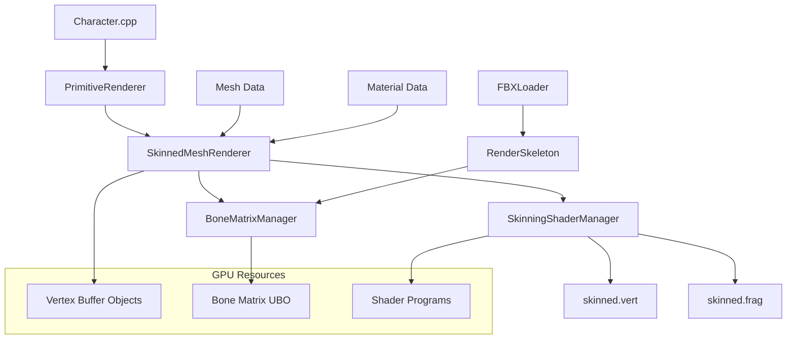

# Design Document: Skeletal Rendering System

## Overview

The Skeletal Rendering System addresses critical rendering issues in Game Engine Kiro by implementing comprehensive support for skeletal mesh rendering. The system integrates with existing FBX loading infrastructure and RenderSkeleton data structures to enable proper display of animated character models.

The core challenge is bridging the gap between the existing skeleton data (loaded by FBXLoader) and the rendering pipeline (PrimitiveRenderer). Currently, the engine can load skeletal data but cannot render it due to missing shader support and incomplete renderer implementation.

This design implements GPU-based vertex skinning using OpenGL 4.6+ features, specialized GLSL shaders, and efficient bone matrix management to achieve real-time skeletal animation rendering.

## Architecture

### System Components



### Integration Points

The system integrates with existing engine components:

- **FBXLoader**: Provides RenderSkeleton data structures with bone hierarchy
- **PrimitiveRenderer**: Extended with DrawSkinnedMesh() implementation
- **Character System**: Uses skeletal rendering through existing interfaces
- **Resource Manager**: Manages shader loading and caching
- **Material System**: Maintains compatibility with existing material pipeline

## Components and Interfaces

### SkinnedMeshRenderer

Primary component responsible for skeletal mesh rendering operations.

```cpp
namespace GameEngine::Graphics::SkeletalRendering {

class SkinnedMeshRenderer {
public:
    // Core rendering interface
    bool DrawSkinnedMesh(const Mesh& mesh,
                        const RenderSkeleton& skeleton,
                        const Material& material,
                        const glm::mat4& modelMatrix);

    // Initialization and cleanup
    bool Initialize();
    void Shutdown();

    // Performance optimization
    void BeginSkinnedBatch();
    void EndSkinnedBatch();

private:
    std::unique_ptr<SkinningShaderManager> m_shaderManager;
    std::unique_ptr<BoneMatrixManager> m_boneManager;

    // OpenGL resources
    GLuint m_boneMatrixUBO;
    GLuint m_vertexArrayObject;

    // Performance tracking
    uint32_t m_renderedMeshes;
    uint32_t m_boneMatrixUpdates;
};

}
```

### SkinningShaderManager

Manages specialized shaders for vertex skinning operations.

```cpp
namespace GameEngine::Graphics::SkeletalRendering {

class SkinningShaderManager {
public:
    // Shader management
    bool LoadSkinningShaders();
    bool ReloadShaders(); // Hot-reloading support

    // Shader binding and uniform management
    void BindSkinningShader();
    void SetBoneMatrices(const std::vector<glm::mat4>& matrices);
    void SetMaterialUniforms(const Material& material);
    void SetTransformUniforms(const glm::mat4& model,
                             const glm::mat4& view,
                             const glm::mat4& projection);

    // Validation and debugging
    bool ValidateShaderProgram();
    void LogShaderInfo();

private:
    GLuint m_skinningProgram;

    // Uniform locations (cached for performance)
    GLint m_boneMatricesLocation;
    GLint m_modelMatrixLocation;
    GLint m_viewMatrixLocation;
    GLint m_projectionMatrixLocation;
    GLint m_materialLocations[8]; // Common material uniforms

    bool CompileShader(const std::string& source, GLenum type, GLuint& shader);
    bool LinkProgram(GLuint vertexShader, GLuint fragmentShader);
};

}
```

### BoneMatrixManager

Efficiently manages bone transformation matrices and GPU uploads.

```cpp
namespace GameEngine::Graphics::SkeletalRendering {

class BoneMatrixManager {
public:
    // Matrix calculation and management
    void CalculateBoneMatrices(const RenderSkeleton& skeleton,
                              std::vector<glm::mat4>& outMatrices);

    void UpdateBoneMatricesUBO(const std::vector<glm::mat4>& matrices);

    // Performance optimization
    void SetMaxBones(uint32_t maxBones);
    uint32_t GetMaxBones() const { return m_maxBones; }

    // GPU resource management
    bool InitializeUBO();
    void CleanupUBO();
    GLuint GetBoneMatrixUBO() const { return m_boneMatrixUBO; }

private:
    static constexpr uint32_t DEFAULT_MAX_BONES = 128;
    static constexpr uint32_t MAX_SUPPORTED_BONES = 256;

    uint32_t m_maxBones;
    GLuint m_boneMatrixUBO;

    // Performance tracking
    uint32_t m_matrixUpdates;
    uint32_t m_uboUpdates;

    void ValidateBoneCount(uint32_t boneCount);
};

}
```

## Data Models

### Enhanced Mesh Structure

Extension to existing Mesh structure to support skeletal data:

```cpp
namespace GameEngine::Graphics {

struct SkeletalMeshData {
    // Vertex skinning data (per vertex)
    std::vector<glm::ivec4> boneIndices;  // Up to 4 bones per vertex
    std::vector<glm::vec4> boneWeights;   // Corresponding weights (sum = 1.0)

    // Validation and utility
    bool IsValid() const;
    void NormalizeWeights();
    uint32_t GetMaxBoneIndex() const;
};

// Extension to existing Mesh class
class Mesh {
    // ... existing members ...

    // Skeletal data (optional)
    std::unique_ptr<SkeletalMeshData> m_skeletalData;

public:
    // Skeletal mesh support
    bool HasSkeletalData() const { return m_skeletalData != nullptr; }
    const SkeletalMeshData* GetSkeletalData() const { return m_skeletalData.get(); }
    void SetSkeletalData(std::unique_ptr<SkeletalMeshData> data);

    // OpenGL buffer management for skeletal data
    void UploadSkeletalDataToGPU();
    void CleanupSkeletalBuffers();

private:
    // Additional VBOs for skeletal data
    GLuint m_boneIndicesVBO;
    GLuint m_boneWeightsVBO;
};

}
```

### Bone Matrix Data Structure

Optimized structure for bone transformation data:

```cpp
namespace GameEngine::Graphics::SkeletalRendering {

struct BoneTransform {
    glm::mat4 finalTransform;     // Final bone transformation matrix
    glm::mat4 offsetMatrix;       // Bone offset matrix (bind pose inverse)
    uint32_t boneIndex;           // Index in bone hierarchy
    bool isDirty;                 // Needs recalculation flag
};

struct SkeletonRenderData {
    std::vector<BoneTransform> bones;
    uint32_t activeBoneCount;
    bool needsMatrixUpdate;

    // Performance optimization
    uint64_t lastUpdateFrame;
    uint32_t updateFrequency;

    void MarkDirty() { needsMatrixUpdate = true; }
    void ClearDirty() { needsMatrixUpdate = false; }
};

}
```

## Correctness Properties

_A property is a characteristic or behavior that should hold true across all valid executions of a system—essentially, a formal statement about what the system should do. Properties serve as the bridge between human-readable specifications and machine-verifiable correctness guarantees._

Agora vou usar a ferramenta prework para analisar os critérios de aceitação antes de escrever as propriedades de correção.

<function_calls>
<invoke name="prework">
<parameter name="featureName">skeletal-rendering-system

### Property 1: Skinned Mesh Rendering Success

_For any_ valid skinned mesh with proper bone data, the renderer should successfully render the mesh with correct bone deformation applied
**Validates: Requirements 1.1**

### Property 2: Vertex Skinning Transformation

_For any_ vertex with bone indices and weights, the skinning shader should apply proper weighted transformation using uploaded bone matrices
**Validates: Requirements 2.1, 2.2, 2.3**

### Property 3: Bone Matrix Update Cycle

_For any_ skeleton pose change, the system should efficiently calculate new bone matrices and upload them to GPU memory
**Validates: Requirements 3.1, 3.2**

### Property 4: Multi-Mesh Independence

_For any_ set of multiple skinned meshes rendered in the same frame, each mesh should be handled independently without interference
**Validates: Requirements 1.4, 3.3**

### Property 5: Bone Influence Constraint

_For any_ vertex in a skinned mesh, the system should support up to 4 bone influences with proper weight normalization
**Validates: Requirements 2.4**

### Property 6: System Compatibility

_For any_ existing material, texture, or non-skinned mesh, the skeletal rendering system should maintain full compatibility without interference
**Validates: Requirements 4.4, 4.5**

### Property 7: GPU Optimization

_For any_ skeletal rendering operation, the system should use GPU buffer objects and execute skinning calculations on the GPU for optimal performance
**Validates: Requirements 5.2, 5.3**

### Property 8: Error Handling Robustness

_For any_ invalid input (mesh data, shader compilation, bone data), the system should handle errors gracefully with descriptive logging and continue operation
**Validates: Requirements 1.5, 2.5, 6.1, 6.2, 6.3**

### Property 9: Existing System Integration

_For any_ FBX-loaded skeleton or Character system call, the skeletal rendering system should integrate seamlessly with existing data structures and interfaces
**Validates: Requirements 4.1, 4.2, 4.3**

### Property 10: Shader Resource Management

_For any_ shader loading, compilation, or cleanup operation, the system should manage resources efficiently with caching and proper GPU memory cleanup
**Validates: Requirements 7.1, 7.2, 7.5**

### Property 11: Performance Optimization

_For any_ rendering scenario with multiple meshes, the system should batch operations efficiently and minimize CPU-GPU synchronization points
**Validates: Requirements 5.1, 5.4**

### Property 12: Development Support

_For any_ shader modification during development, the system should support hot-reloading and provide debug visualization options
**Validates: Requirements 6.4, 7.3**

## Error Handling

### Graceful Degradation Strategy

The system implements comprehensive error handling to ensure stability:

1. **Invalid Mesh Data**: Log descriptive errors and skip rendering while maintaining frame stability
2. **Shader Compilation Failures**: Provide detailed error information and fall back to wireframe rendering
3. **Bone Data Corruption**: Detect corruption early and use identity matrices as fallback
4. **GPU Resource Exhaustion**: Automatically reduce bone count or batch size with warning logs
5. **OpenGL Errors**: Capture and report all OpenGL errors with context information

### Error Recovery Mechanisms

```cpp
namespace GameEngine::Graphics::SkeletalRendering {

enum class SkeletalRenderingError {
    None = 0,
    InvalidMeshData,
    ShaderCompilationFailed,
    BoneDataCorrupted,
    GPUResourceExhausted,
    OpenGLError
};

class ErrorHandler {
public:
    static void HandleError(SkeletalRenderingError error, const std::string& context);
    static bool CanRecover(SkeletalRenderingError error);
    static void AttemptRecovery(SkeletalRenderingError error);

private:
    static void LogError(SkeletalRenderingError error, const std::string& context);
    static void FallbackToWireframe();
    static void ReduceBoneComplexity();
};

}
```

## Testing Strategy

### Dual Testing Approach

The skeletal rendering system requires both unit tests and property-based tests for comprehensive coverage:

**Unit Tests** focus on:

- Specific shader compilation scenarios
- Known bone transformation calculations
- Integration points with existing systems
- Error handling with specific invalid inputs
- OpenGL resource management edge cases

**Property-Based Tests** focus on:

- Universal properties across all valid skeletal meshes
- Bone matrix calculations with randomized skeleton data
- Vertex skinning transformations with various bone influences
- Performance characteristics under different load conditions
- Compatibility with randomly generated material and texture combinations

### Property-Based Testing Configuration

All property tests will use a minimum of 100 iterations to ensure comprehensive coverage through randomization. Each test will be tagged with the format:

**Feature: skeletal-rendering-system, Property {number}: {property_text}**

The testing framework will generate:

- Random skeletal meshes with varying bone counts (1-128 bones)
- Random bone transformations and hierarchies
- Random vertex weights and bone indices (1-4 influences per vertex)
- Random material and texture combinations
- Various error conditions and edge cases

### Shader Testing Strategy

Shader testing presents unique challenges due to GPU execution:

- **Mathematical Validation**: Test vertex transformation math using CPU calculations
- **Matrix Upload Verification**: Verify bone matrices are correctly uploaded to GPU
- **Rendering Output Validation**: Use framebuffer capture to verify visual output
- **Performance Profiling**: Measure GPU execution time and memory usage

### Integration Testing

Integration tests verify seamless operation with existing engine systems:

- FBX loading → Skeletal rendering pipeline
- Character system → DrawSkinnedMesh() calls
- Animation updates → Rendering reflection
- Material system → Skinned mesh compatibility
- Resource management → Shader loading and cleanup
